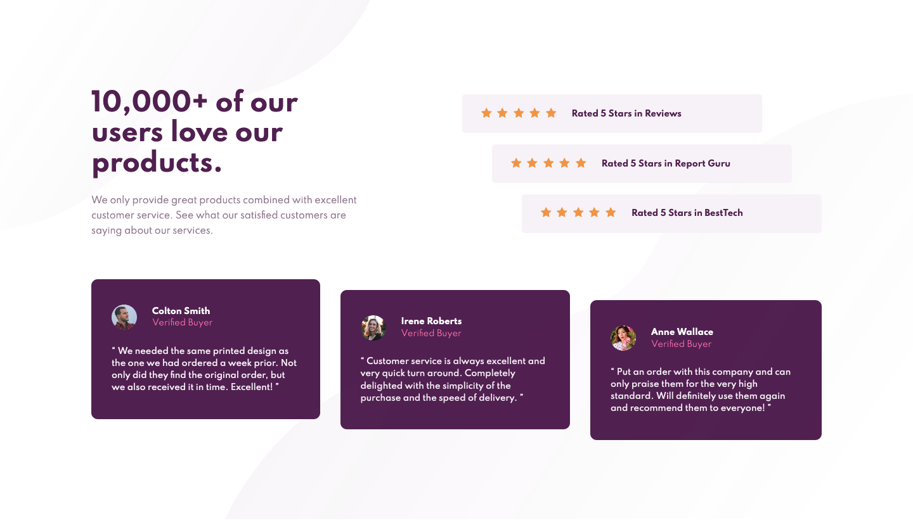
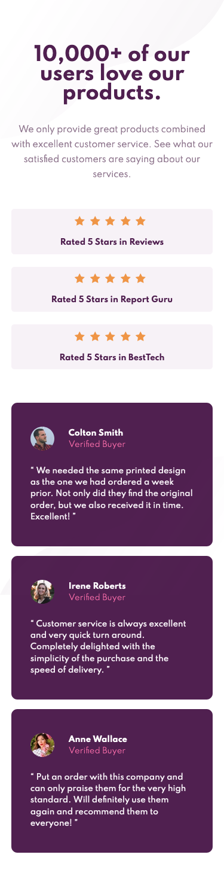

# Frontend Mentor - Social proof section solution

This is a solution to the [Social proof section challenge on Frontend Mentor](https://www.frontendmentor.io/challenges/social-proof-section-6e0qTv_bA).

## Table of contents

- [Overview](#overview)
    - [Screenshots](#screenshots)
    - [Links](#links)
- [My process](#my-process)
    - [Built with](#built-with)
    - [What I learned](#what-i-learned)
    - [Useful resources](#useful-resources)
    
## Overview

### Screenshots

### Links
- [Solution URL(static page)](https://adi2991.github.io/FEM-social-proof-section/)

## My process

### Built with
- Flexbox
- CSS Grid

### What I learned

Use this section to recap over some of your major learnings while working through this project. Writing these out and providing code samples of areas you want to highlight is a great way to reinforce your own knowledge.

### Useful resources

- [Complete Guide to Flexbox (CSS-Tricks)](https://css-tricks.com/snippets/css/a-guide-to-flexbox/)
- [Complete Guide to Grid (CSS-Tricks)](https://css-tricks.com/snippets/css/complete-guide-grid/)
- [Complete Guide to Media Queries (CSS-Tricks)](https://css-tricks.com/a-complete-guide-to-css-media-queries/)
